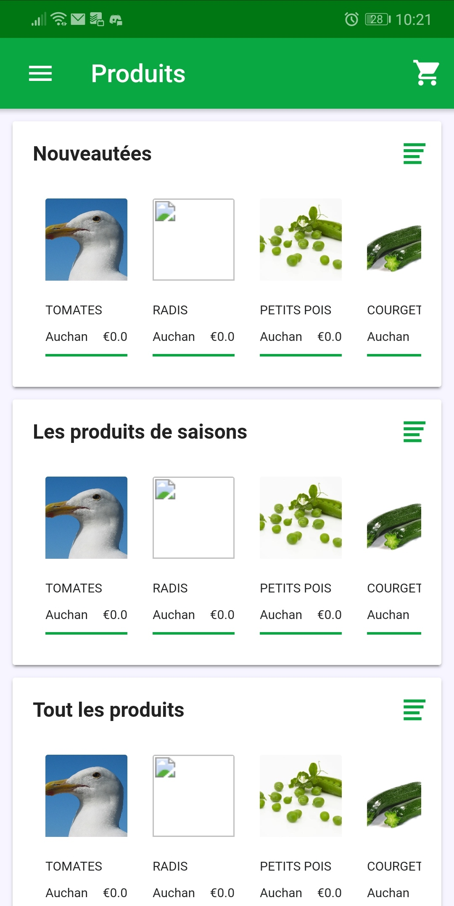
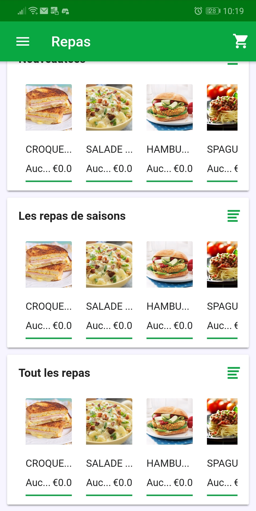
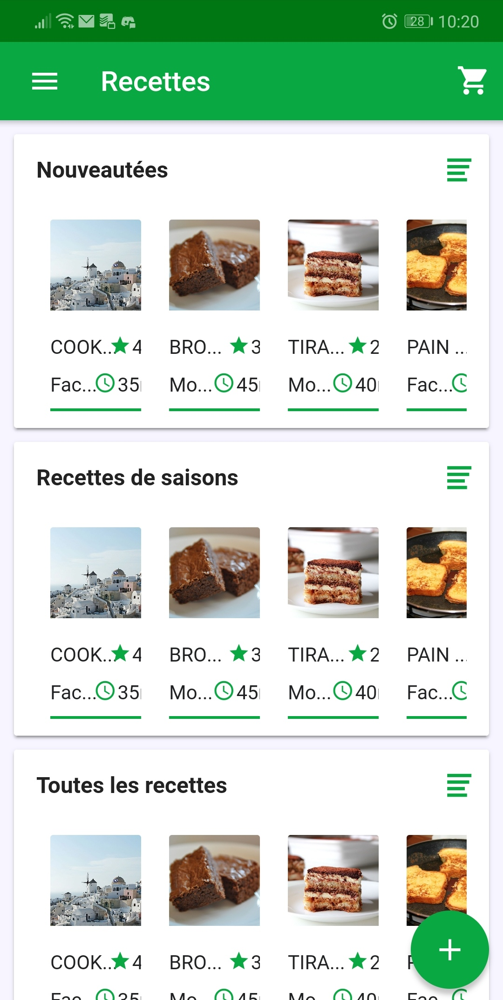
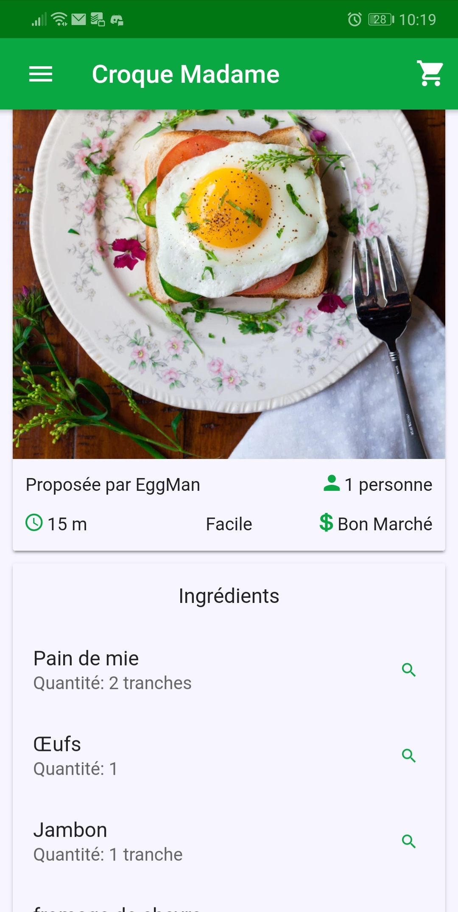
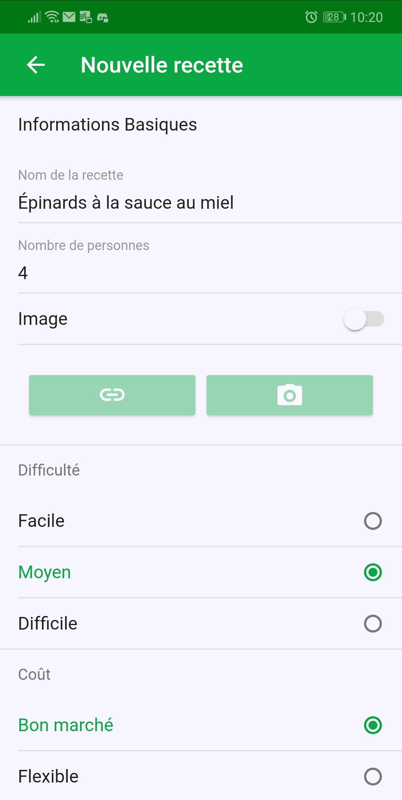

# About Am'app


## Description

Am'app is a mobile application for *iOS* and *Android*. It allows the linking between the local farmers and AMAPs (association for the maintain of proximity agriculture or in french Association pour le Maintien d'une agriculture de proximité) with potential clients.
The application is separated in distinct parts :

* A product catalog provided by AMAPs and local farmer.
* A meal catalog, also provided by AMAPs and local farmers.
* A collaborative recipe catalog based on a healthy alimentation philosophy.

These three catalogs are stored in a databased shared between, the Am'app application and the Am'manager website.







## Functionalities

In the scheme of these products (Am'app and Am'manager), there are two types of targets:

* The client, who uses the Am'app application to order products, meal, follow and concoct recipes.
* The supplier, who can sell product and meal with application.

## Software used

[Ionic](https://ionicframework.com/) is the main framework used. It allows to easily create a web application with a mobile viewport.

[Cordova](https://cordova.apache.org/) is used to deploy a web based application on mobile operating systems. It deploys it on Android and iOS.

# Building Instruction

## Prerequisites

To fork the application, you need to first install a minimum of software. We describe the minimum of software that you'll need to install to run the application only on your computer.

1. First [download nodejs](https://nodejs.org/en/download/) on your computer. On linux the binary is named ```node``` but a binary named ```nodejs``` is required. The trick is to link it with the above command:
```
sudo ln -s "$(which node)" /usr/bin/nodejs
```

2. Check the installation inside a terminal with ```npm -v``` and ```node -v```.
3. Follow the [Ionic guide](https://ionicframework.com/getting-started#cli): download the ionic command line tool with
```
npm install -g ionic
```
4. For windows install a [git bash client](https://git-scm.com/download/win) of your choice (you can also use the provided link if your lazy.)

## Basic install

These instructions are valid for a Linux OS. The commands for Windows are the same inside the git bash terminal.
1. You first need to clone the project to use it:
```
git clone https://github.com/Nataell/TPEcarElec.git
```

2. Go to the repository: ```cd TPEcarElec```

3. Get the most recent version using the git tag ```git checkout latest```.

4. Install the needed packages for the project with ```npm update```.

5. Run the local server to use the app ```ionic serve```

## More information

For specific Android installation, follow the **INSTALL.md** file. **We didn't use iOS, so you will need to find yourself how to use Ionic with iOS**.

# About Am'manager

Am'manager is a website for the farmers and AMAPs. It allows them to manage their supplies, add new supplies, manage commands made by clients (accept them or not.) and get sellings stats over time.
